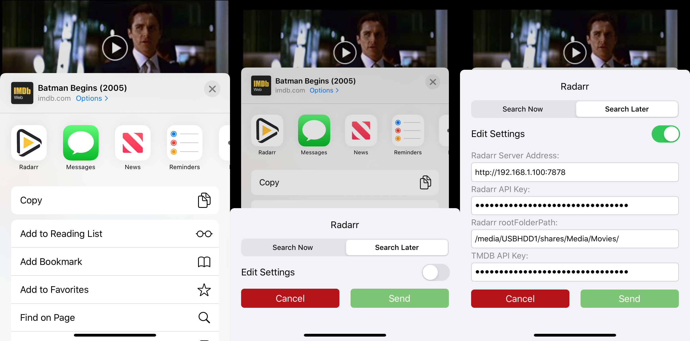

# RadarrExtension
> iOS extension share sheet that takes a movie url from IMDb app or website and sends it to Radarr server.

[![Swift Version][swift-image]][swift-url] [](http://cocoapods.org/pods/LFAlertController)
<!--
[![Build Status][travis-image]][travis-url]
[![License][license-image]][license-url]
[](https://img.shields.io/cocoapods/v/LFAlertController.svg)  
-->

<!--
[](http://makeapullrequest.com)
-->

Ever wish you could send a movie to Radarr straight from an IMDb movie page? Well now you can! No more re-searching for a movie you already found in yet another interface.



## Features

- [x] Set whether to search immediately or later
- [x] Set monitored status
- [x] Set quality profile
- [x] Set min availability
- [x] Set path

## Requirements

- iOS 13.0+
- Xcode 11+

## SPM Dependencies

- [KeychainAccess 4.2+](https://github.com/kishikawakatsumi/KeychainAccess)
- [Zephyr 3.6+](https://github.com/ArtSabintsev/Zephyr)
- [PromiseKit 6.13.3+](https://github.com/mxcl/PromiseKit)
- [AwaitKit 5.2+](https://github.com/yannickl/AwaitKit)

## Credits

- String Extension from [Hacking With Swift](https://www.hackingwithswift.com/example-code/strings/how-to-convert-a-string-to-a-safe-format-for-url-slugs-and-filenames)
- Rounded buttons by [Adam Fils](https://medium.com/@filswino/easiest-implementation-of-rounded-buttons-in-xcode-6627efe39f84)

<!--
## Installation

#### CocoaPods
You can use [CocoaPods](http://cocoapods.org/) to install `YourLibrary` by adding it to your `Podfile`:

```ruby
platform :ios, '8.0'
use_frameworks!
pod 'YourLibrary'
```

To get the full benefits import `YourLibrary` wherever you import UIKit

``` swift
import UIKit
import YourLibrary
```

#### Manually
1. Download and drop ```YourLibrary.swift``` in your project.  
2. Congratulations!  

## Usage example

```swift
import EZSwiftExtensions
ez.detectScreenShot { () -> () in
    print("User took a screen shot")
}
```

## Contribute

We would love you for the contribution to **YourLibraryName**, check the ``LICENSE`` file for more info.
-->


## Meta

<!--
Your Name – [@YourTwitter](https://twitter.com/dbader_org) – YourEmail@example.com

Distributed under the XYZ license. See ``LICENSE`` for more information.
-->

[https://github.com/xdahlia/RadarrExtension](https://github.com/xdahlia/RadarrExtension/)

## Acknowledgements / Disclaimer / Copyright / Attribution
- [TMDb API](https://developers.themoviedb.org/3)
- [IMDb API](https://developer.imdb.com)
- [Radarr Logo](https://github.com/Radarr/Radarr)
- Unofficial / Not affiated with Radarr

[swift-image]:https://img.shields.io/badge/swift-5.1-yellow.svg
[swift-url]: https://swift.org/
[license-image]: https://img.shields.io/badge/License-MIT-yellow.svg
[license-url]: LICENSE
[travis-image]: https://img.shields.io/travis/dbader/node-datadog-metrics/master.svg?style=flat-square
[travis-url]: https://travis-ci.org/dbader/node-datadog-metrics
[codebeat-image]: https://codebeat.co/badges/c19b47ea-2f9d-45df-8458-b2d952fe9dad
[codebeat-url]: https://codebeat.co/projects/github-com-vsouza-awesomeios-com
